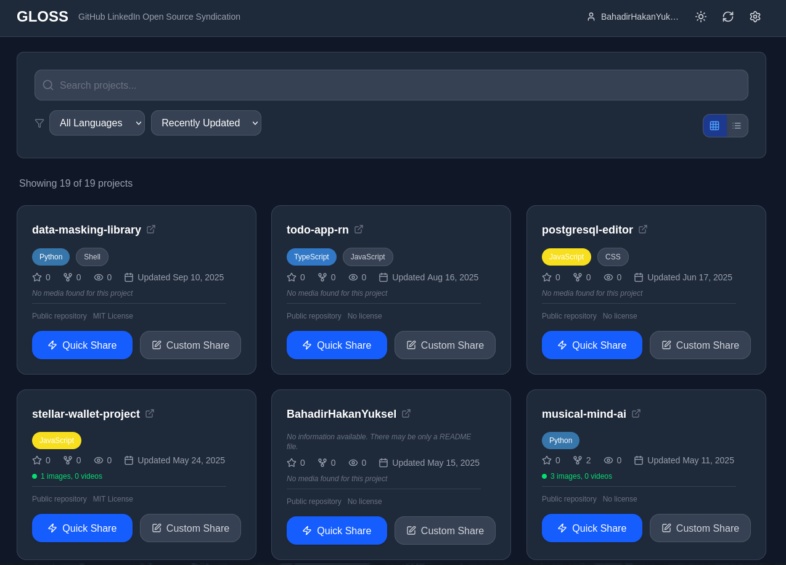
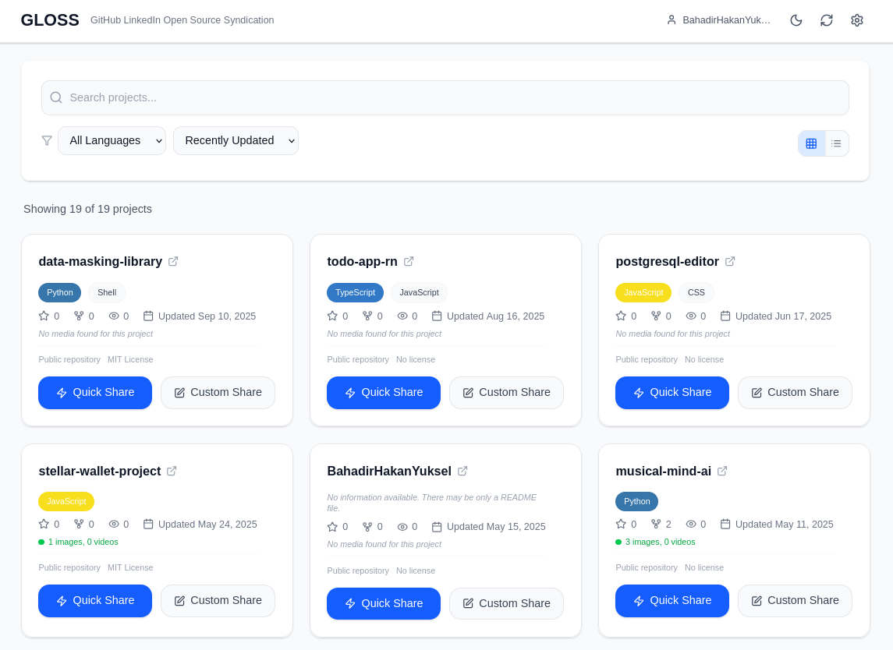
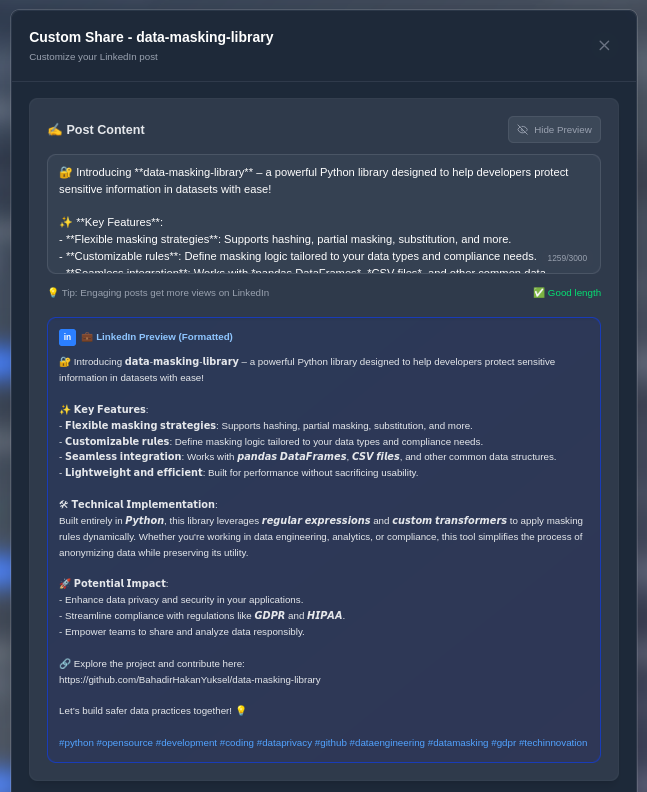
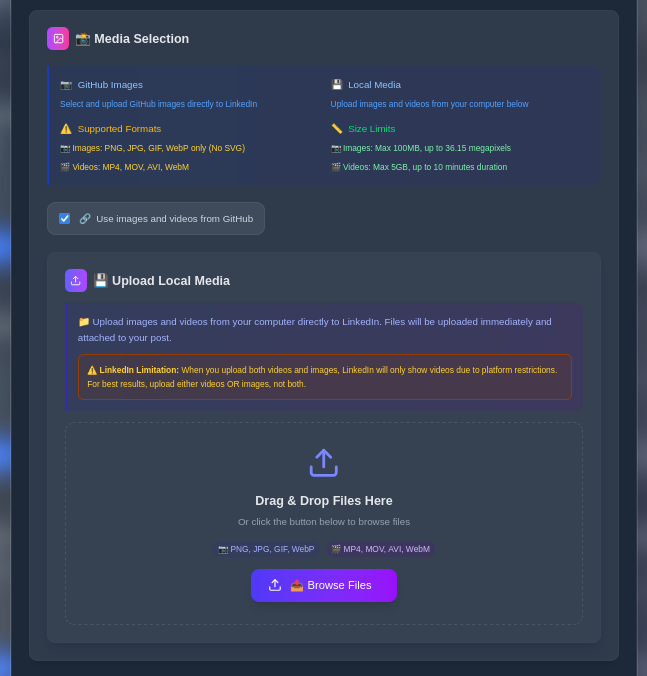
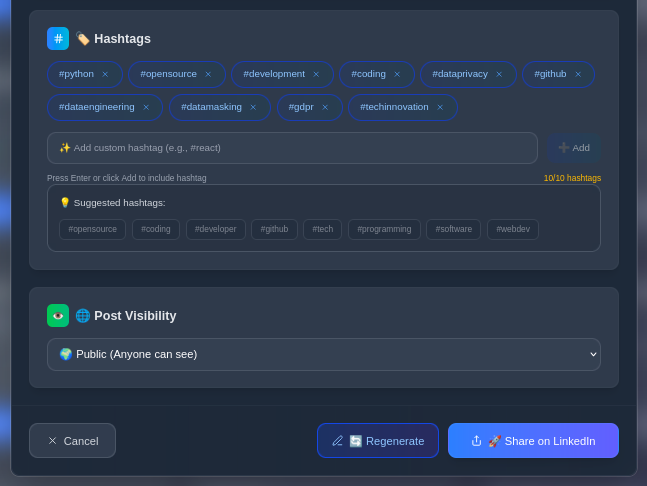

# 🌟 GLOSS - GitHub LinkedIn Open Source System


**GLOSS (GitHub LinkedIn Open Source System)** - An AI-powered modern platform for sharing your GitHub projects on LinkedIn and other social media platforms. Promote your projects effectively across social networks with professional content and connect with the open source community.

> **🚧 BETA RELEASE v0.1.0** - This version is in beta stage. We welcome your feedback!

[](https://nextjs.org/)
[](https://typescriptlang.org/)
[](https://tailwindcss.com/)
[](https://opensource.org/licenses/MIT)

> **🌍 Language / Dil:** **English** | [Türkçe](README.tr.md)

## ✨ Features

### 🌐 Multi-Platform System (Future Vision)

**GLOSS System Goal:** Automatically distribute your GitHub projects from a single platform to all social media channels.

**Currently Supported:**

- ✅ **LinkedIn** - Optimized sharing for professional networks

**Coming Soon Platforms:**

- 🔄 **Twitter/X** - Short-format posts for developer community
- 🔄 **Reddit** - Automatic sharing to communities like r/programming, r/opensource
- 🔄 **Discord** - Webhook integration to developer servers
- 🔄 **Medium** - Detailed technical blog articles
- 🔄 **Dev.to** - Developer-focused article system

### 🤖 AI-Powered Content Generation

- **DeepSeek AI Integration**: Automatically generates professional LinkedIn posts for your projects
- **Smart Content Analysis**: Creates appropriate content through project structure, README files and code analysis
- **Customizable Posts**: Edit and personalize content generated by AI

### 📱 Modern and Responsive Design

- **Mobile-First Approach**: Perfect user experience on all devices
- **Glassmorphism UI**: Modern, transparent and aesthetic interface design
- **Responsive Navigation**: Mobile-optimized navbar and filtering system

### 🔗 LinkedIn Integration

- **Quick Share**: One-click automatic content generation and sharing
- **Custom Share**: Personalized posts with manual editing
- **Media Management**: Upload images/videos from GitHub and transfer to LinkedIn
- **Hashtag Management**: Smart hashtag suggestions and customization

### 🎨 Advanced Features

- **Live Preview**: Real-time preview in LinkedIn view
- **Media Filtering**: Automatic detection of LinkedIn-compatible formats
- **Secure Authentication**: Secure connection with OAuth 2.0
- **Project Filtering**: Filter by language, date, popularity
- **Loading Screen**: Beautiful loading animation during authentication
- **Soft UI Design**: Modern soft interface design

## 🛠️ Technology Stack

### Frontend

- **Next.js 15** - React framework with App Router
- **TypeScript** - Type-safe development
- **Tailwind CSS** - Utility-first CSS framework
- **Lucide Icons** - Beautiful icon library
- **React Hooks** - Modern state management

### Backend & API

- **Next.js API Routes** - Serverless functions
- **LinkedIn API v2** - Social media integration
- **GitHub API v4** - Repository data fetching
- **DeepSeek AI API** - Content generation

### Security & Authorization

- **OAuth 2.0** - Secure authentication
- **Local Storage Encryption** - Secure credential storage
- **CORS Protection** - Cross-origin request security

## 📷 Screenshots

### 🔐 Login and Main Interface

<div align="center">

#### Login Screen


<p>_Secure OAuth 2.0 integration with GitHub, LinkedIn and DeepSeek AI_</p>

#### Main Project List



<p>_Filter, search and select your GitHub projects for sharing_</p>

</div>

### 🎨 Theme Support

<div align="center">

| Light Theme                                      | Dark Theme                                     |
| ------------------------------------------------ | ---------------------------------------------- |
|  |  |
| _Modern glassmorphism UI - Light theme_          | _Eye-friendly dark theme support_              |

</div>

### ✍️ Content Editing and Sharing

<div align="center">

#### AI-Powered Content Editing



<p>_Edit AI-generated content and preview how it looks on LinkedIn_</p>

#### Media Selection and Management



<p>_Select media from GitHub or upload your own files with drag & drop_</p>

#### Hashtag Management and Sharing



<p>_Professional sharing with intelligent hashtag suggestions_</p>

</div>

## 🚀 Quick Start

### Requirements

- **Node.js** 18.0 or higher
- **npm** or **yarn** package manager
- **GitHub** account
- **LinkedIn** account
- **DeepSeek AI** API key

### Installation

1. **Clone the project**

   ```bash
   git clone https://github.com/your-username/gloss.git
   cd gloss
   ```

2. **Install dependencies**

   ```bash
   npm install
   # or
   yarn install
   ```

3. **Start development server**

   ```bash
   npm run dev
   # or
   yarn dev
   ```

4. **Open in browser**
   ```
   http://localhost:3000
   ```

## 📋 How to Get API Keys?

### GitHub Personal Access Token

1. GitHub → Settings → Developer settings → Personal access tokens
2. Select "Generate new token (classic)"
3. Grant the following permissions:
   - `repo` (repository access)
   - `user` (user information)
4. Copy the token and store it securely

### LinkedIn API Keys

1. [LinkedIn Developer Portal](https://developer.linkedin.com/) → Create App
2. Fill in application information
3. Add "Sign In with LinkedIn" product
4. Get Client ID and Client Secret
5. Redirect URL: `http://localhost:3000/api/auth/callback/linkedin`

### DeepSeek AI API Key

GLOSS currently uses DeepSeek API through **OpenRouter**. Here are the advantages of this approach:

#### Using OpenRouter (Current Configuration) ⭐

1. Create an account on [OpenRouter](https://openrouter.ai/)
2. Get a new API key from the API Keys section (format: `sk-or-...`)
3. **Advantages:**
   - Access to 100+ different AI models with a single API key
   - Automatic failover and load balancing
   - Better rate limiting and cost optimization
   - Free tier: `deepseek/deepseek-chat-v3.1:free` model
   - Unified pricing and usage tracking

#### Direct DeepSeek API (Alternative)

1. Create an account on [DeepSeek Platform](https://platform.deepseek.com/)
2. Create a new key from the API Keys section
3. **Limitations:**
   - Access only to DeepSeek models
   - Separate rate limiting system
   - Separate billing system
   - Less model variety

> **💡 Recommendation:** Continue using OpenRouter. It provides a more flexible and reliable infrastructure.

## 🎯 Usage Guide

### Initial Setup

1. **Login**: Login with GitHub, LinkedIn and DeepSeek credentials ([Login screen](docs/screenshots/login.png))
2. **Load Projects**: Your GitHub repositories are loaded automatically ([Main interface](docs/screenshots/main.png))
3. **Select Project**: Choose the project you want to share

### Quick Share

1. Click the **"Quick Share"** button on the project card
2. AI automatically generates content and uploads GitHub images
3. Content is automatically shared on LinkedIn

### Custom Share

1. Click the **"Custom Share"** button on the project card
2. Edit the content generated by AI ([Content editing](docs/screenshots/post-content.png))
3. Select images or upload your own images ([Media selection](docs/screenshots/media-selection.png))
4. Customize hashtags ([Hashtag management](docs/screenshots/hashtags-and-sharing.png))
5. Click the **"Share on LinkedIn"** button

### Advanced Features

- **Preview**: Open/close LinkedIn preview with Eye/EyeOff button
- **Filtering**: Filter your projects by programming language
- **Theme Switching**: Toggle between light and dark themes ([Theme examples](docs/screenshots/light-theme.png))
- **Sorting**: Sort by update date, star count, etc.
- **View**: Switch between grid or list view

## 🔧 Development

### Project Structure

```
gloss/
├── src/
│   ├── app/                 # Next.js App Router
│   │   ├── api/            # API endpoints
│   │   ├── globals.css     # Global styles
│   │   └── page.tsx        # Main page
│   ├── components/         # React components
│   │   ├── LoginForm.tsx   # Authentication form
│   │   ├── LoadingScreen.tsx # Loading animation
│   │   ├── ProjectCard.tsx # Project display card
│   │   ├── ProjectList.tsx # Project list with filtering
│   │   └── ShareModal.tsx  # Share modal with AI integration
│   ├── contexts/           # React contexts
│   │   └── AuthContext.tsx # Authentication state
│   ├── services/           # External services
│   │   └── api.ts         # API service classes
│   ├── types/              # TypeScript definitions
│   │   └── index.ts       # Type definitions
│   └── utils/              # Utility functions
│       └── helpers.ts     # Helper functions
├── public/                 # Static assets
├── tailwind.config.js     # Tailwind configuration
├── tsconfig.json          # TypeScript configuration
└── package.json           # Dependencies
```

### Important Components

#### `LoadingScreen.tsx`

- Beautiful loading animation
- Authentication initialization
- Smooth user experience

#### `ShareModal.tsx`

- AI content generation
- LinkedIn sharing operations
- Media management
- Preview system

#### `ProjectList.tsx`

- GitHub repository list
- Responsive filtering
- Search and sorting

#### `AuthContext.tsx`

- Authentication state management
- API credential storage
- Secure token management

### Contributing

1. Fork the project
2. Create a feature branch (`git checkout -b feature/amazing-feature`)
3. Commit your changes (`git commit -m 'Add amazing feature'`)
4. Push the branch (`git push origin feature/amazing-feature`)
5. Create a Pull Request

## 🐛 Troubleshooting

### Common Issues

**API Connection Error**

- Check your API keys
- Verify your network connection
- You might have hit the rate limit

**LinkedIn Sharing Error**

- Make sure your LinkedIn access token is valid
- Check that you have sharing permission
- Verify that media files are in supported format

**Image Upload Error**

- Make sure file size is less than 100MB
- Use supported formats (PNG, JPG, GIF, WebP)
- SVG files are not supported by LinkedIn

### Developer Tools

```bash
# Linting
npm run lint

# Type checking
npm run type-check

# Build
npm run build

# Production preview
npm run start
```

## 📊 Performance

- **Lighthouse Score**: 95+ (Performance, Accessibility, Best Practices)
- **Bundle Size**: Optimized < 500KB
- **Loading Time**: First page load < 2s
- **Mobile Experience**: 100% responsive

## 🔒 Security

- **OAuth 2.0**: Secure authentication
- **Token Encryption**: Local storage encryption
- **HTTPS Only**: HTTPS only in production
- **CORS Protection**: API endpoint protection
- **Input Validation**: All user inputs are validated

## 📈 Roadmap

### v1.1 (Coming Soon)

- [ ] Bulk sharing (Multiple project sharing)
- [ ] Scheduled posting (Scheduled sharing)
- [ ] Analytics dashboard (Share analytics)
- [ ] Custom templates (Custom templates)

### v1.2 (Future)

- [ ] Twitter/X integration
- [ ] Team collaboration
- [ ] Advanced AI prompts
- [ ] Multi-language support

## 🤝 Community

- **GitHub Issues**: Bug reports and feature requests
- **Discussions**: General discussions and questions
- **Email**: bhyuksel0@gmail.com

## 📄 License

This project is licensed under the [MIT License](LICENSE).

## 🙏 Acknowledgments

- **Next.js Team** - Amazing React framework
- **Tailwind CSS** - Beautiful utility-first CSS
- **LinkedIn** - Developer API access
- **DeepSeek** - AI-powered content generation
- **Lucide Icons** - Beautiful icon library
- **Vercel** - Hosting and deployment platform

---

<div align="center">
  <p>
    <strong>Share your GitHub projects with the world using GLOSS! 🌟</strong>
  </p>
  <p>
    <a href="https://github.com/your-username/gloss">⭐ Star</a> •
    <a href="https://github.com/your-username/gloss/issues">🐛 Issues</a> •
    <a href="https://github.com/your-username/gloss/discussions">💬 Discussions</a>
  </p>
</div>
