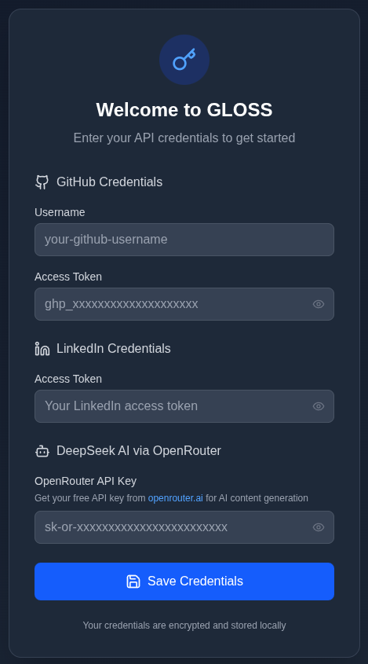
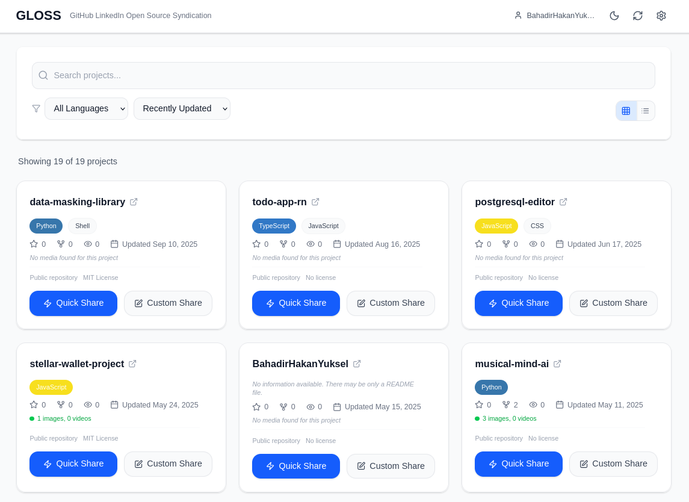
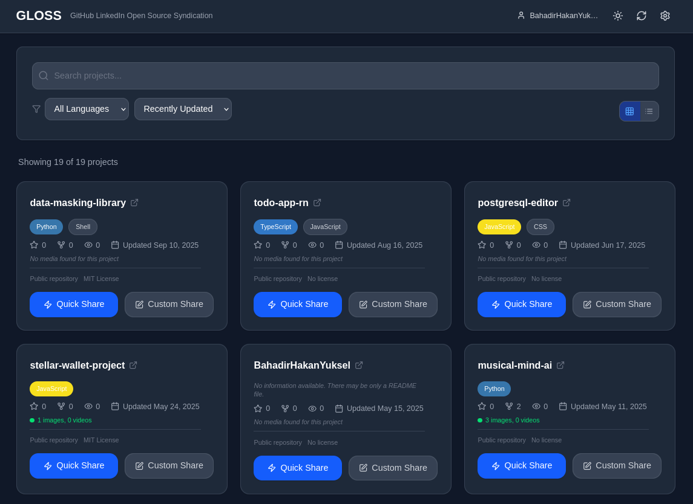
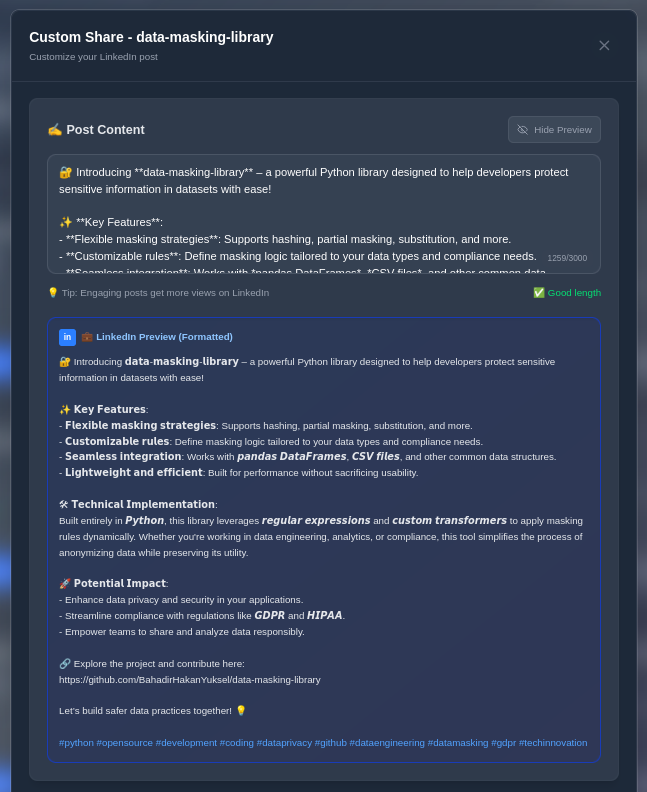
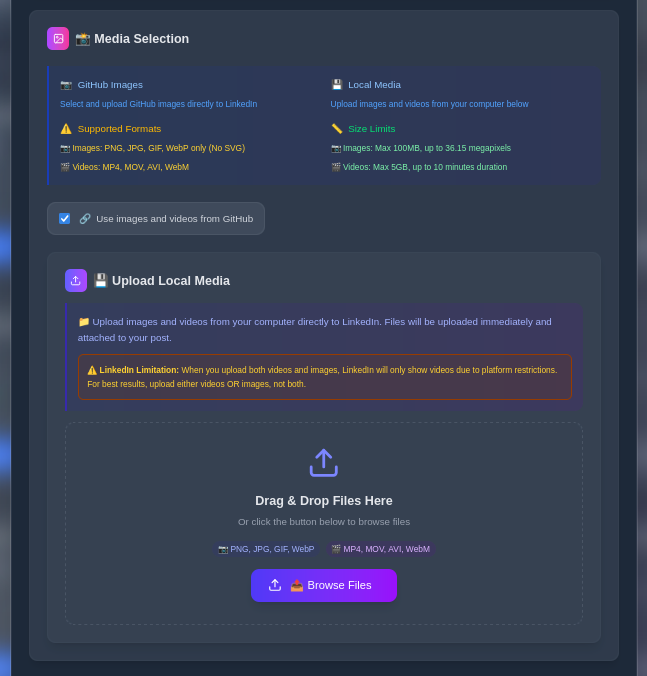
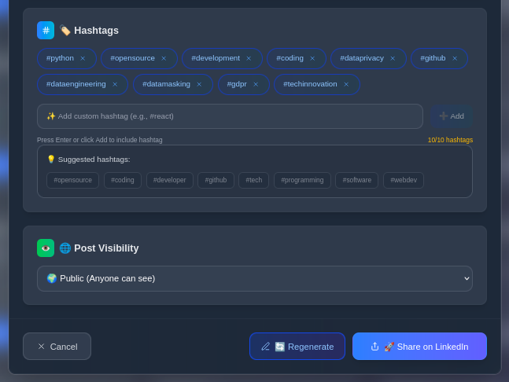

# 🌟 GLOSS - GitHub LinkedIn Open Source System


**GLOSS (GitHub LinkedIn Open Source System)** - GitHub projelerinizi LinkedIn ve diğer sosyal medya platformlarında paylaşmak için AI destekli modern bir platform. Projelerinizi profesyonel içeriklerle sosyal ağlarda etkili bir şekilde tanıtın ve açık kaynak topluluğuyla bağlantı kurun.

> **🚧 BETA RELEASE v0.1.0** - Bu sürüm beta aşamasındadır. Geri bildirimlerinizi bekliyoruz!

[](https://nextjs.org/)
[](https://typescriptlang.org/)
[](https://tailwindcss.com/)
[](https://opensource.org/licenses/MIT)

> **🌍 Language / Dil:** [English](README.md) | **Türkçe**

## ✨ Özellikler

### 🌐 Multi-Platform System (Gelecek Vizyon)

**GLOSS'un System Hedefi:** GitHub projelerinizi tek bir platformdan tüm sosyal medya kanallarına otomatik olarak dağıtmak.

**Şu Anda Desteklenen:**

- ✅ **LinkedIn** - Profesyonel network için optimize edilmiş paylaşım

**Yakında Gelecek Platformlar:**

- 🔄 **Twitter/X** - Developer community için kısa format paylaşımlar
- 🔄 **Reddit** - r/programming, r/opensource gibi communitylere otomatik paylaşım
- 🔄 **Discord** - Developer server'larına webhook entegrasyonu
- 🔄 **Medium** - Detaylı teknik blog yazıları
- 🔄 **Dev.to** - Developer-focused article system

### 🤖 AI-Powered İçerik Üretimi

- **DeepSeek AI Entegrasyonu**: Projeleriniz için profesyonel LinkedIn gönderileri otomatik olarak oluşturur
- **Akıllı İçerik Analizi**: Proje yapısı, README dosyası ve kod analizi ile uygun içerik üretir
- **Özelleştirilebilir Gönderiler**: AI tarafından üretilen içerikleri düzenleyebilir ve kişiselleştirebilirsiniz

### 📱 Modern ve Responsive Tasarım

- **Mobile-First Yaklaşım**: Tüm cihazlarda mükemmel kullanıcı deneyimi
- **Glassmorphism UI**: Modern, şeffaf ve estetik arayüz tasarımı
- **Responsive Navigation**: Mobile-optimized navbar ve filtreleme sistemi

### 🔗 LinkedIn Entegrasyonu

- **Hızlı Paylaşım**: Tek tıkla otomatik içerik üretimi ve paylaşım
- **Özel Paylaşım**: Manuel düzenleme ile kişiselleştirilmiş gönderiler
- **Medya Yönetimi**: GitHub'dan görsel/video yükleme ve LinkedIn'e aktarım
- **Hashtag Yönetimi**: Akıllı hashtag önerileri ve özelleştirme

### 🎨 Gelişmiş Özellikler

- **Canlı Önizleme**: LinkedIn görünümünde real-time önizleme
- **Medya Filtreleme**: LinkedIn uyumlu formatları otomatik tespit
- **Güvenli Kimlik Doğrulama**: OAuth 2.0 ile güvenli bağlantı
- **Proje Filtreleme**: Dil, tarih, popülerlik bazında filtreleme
- **Loading Screen**: Kimlik doğrulama sırasında güzel yükleme animasyonu
- **Soft UI Design**: Modern yumuşak arayüz tasarımı

## 🛠️ Teknoloji Stack

### Frontend

- **Next.js 15** - React framework with App Router
- **TypeScript** - Type-safe development
- **Tailwind CSS** - Utility-first CSS framework
- **Lucide Icons** - Beautiful icon library
- **React Hooks** - Modern state management

### Backend & API

- **Next.js API Routes** - Serverless functions
- **LinkedIn API v2** - Social media integration
- **GitHub API v4** - Repository data fetching
- **DeepSeek AI API** - Content generation

### Güvenlik & Yetkilendirme

- **OAuth 2.0** - Secure authentication
- **Local Storage Encryption** - Secure credential storage
- **CORS Protection** - Cross-origin request security

## 📷 Ekran Görüntüleri

### 🔐 Giriş ve Ana Ekran

<div align="center">

#### Giriş Ekranı



<p>_Güvenli OAuth 2.0 ile GitHub, LinkedIn ve DeepSeek AI entegrasyonu_</p>

#### Ana Proje Listesi


<p>_GitHub projelerinizi filtreleyin, arayın ve paylaşım için seçin_<p/>

</div>

### 🎨 Tema Desteği

<div align="center">

| Açık Tema                                      | Koyu Tema                                     |
| ---------------------------------------------- | --------------------------------------------- |
|  |  |
| _Modern glassmorphism UI - Açık tema_          | _Gözü yormayan koyu tema desteği_             |

</div>

### ✍️ İçerik Düzenleme ve Paylaşım

<div align="center">

#### AI-Destekli İçerik Düzenleme



<p>_DeepSeek AI ile oluşturulan içeriği düzenleyin ve LinkedIn preview görün_<p/>

#### Medya Seçimi ve Yönetimi



<p>_GitHub'dan medya seçin veya kendi dosyalarınızı drag & drop ile yükleyin_<p/>

#### Hashtag Yönetimi ve Paylaşım



<p>_Akıllı hashtag önerileri ile profesyonel paylaşım yapın_<p/>

</div>

## 🚀 Hızlı Başlangıç

### Gereksinimler

- **Node.js** 18.0 veya üzeri
- **npm** veya **yarn** package manager
- **GitHub** hesabı
- **LinkedIn** hesabı
- **DeepSeek AI** API anahtarı

### Kurulum

1. **Projeyi klonlayın**

   ```bash
   git clone https://github.com/your-username/gloss.git
   cd gloss
   ```

2. **Bağımlılıkları yükleyin**

   ```bash
   npm install
   # veya
   yarn install
   ```

3. **Geliştirme sunucusunu başlatın**

   ```bash
   npm run dev
   # veya
   yarn dev
   ```

4. **Tarayıcıda açın**
   ```
   http://localhost:3000
   ```

## 📋 API Anahtarları Nasıl Alınır?

### GitHub Personal Access Token

1. GitHub → Settings → Developer settings → Personal access tokens
2. "Generate new token (classic)" seçin
3. Aşağıdaki izinleri verin:
   - `repo` (repository access)
   - `user` (user information)
4. Token'ı kopyalayın ve güvenli bir yerde saklayın

### LinkedIn API Anahtarları

1. [LinkedIn Developer Portal](https://developer.linkedin.com/) → Create App
2. Uygulama bilgilerini doldurun
3. "Sign In with LinkedIn" ürününü ekleyin
4. Client ID ve Client Secret'ı alın
5. Redirect URL: `http://localhost:3000/api/auth/callback/linkedin`

### DeepSeek AI API Key

GLOSS şu anda **OpenRouter** üzerinden DeepSeek API'sini kullanmaktadır. Bu yaklaşımın avantajları:

#### OpenRouter Kullanımı (Mevcut Konfigürasyon) ⭐

1. [OpenRouter](https://openrouter.ai/) hesabı oluşturun
2. API Keys bölümünden yeni bir anahtar alın (`sk-or-...` formatında)
3. **Avantajlar:**
   - Tek API anahtarıyla 100+ farklı AI modeline erişim
   - Otomatik failover ve load balancing
   - Daha iyi rate limiting ve cost optimization
   - Free tier: `deepseek/deepseek-chat-v3.1:free` modeli
   - Unified pricing ve kullanım takibi

#### Direkt DeepSeek API (Alternatif)

1. [DeepSeek Platform](https://platform.deepseek.com/) hesabı oluşturun
2. API Keys bölümünden yeni bir anahtar alın
3. **Limitler:**
   - Sadece DeepSeek modellerine erişim
   - Kendi rate limiting sistemi
   - Ayrı faturalama sistemi
   - Daha az model çeşitliliği

> **💡 Öneri:** OpenRouter kullanmaya devam edin. Daha esnek ve güvenilir bir altyapı sunar.

## 🎯 Kullanım Kılavuzu

### İlk Kurulum

1. **Giriş Yap**: GitHub, LinkedIn ve DeepSeek credentials ile giriş yapın ([Login ekranı](docs/screenshots/login.png))
2. **Projeleri Yükle**: GitHub repository'leriniz otomatik olarak yüklenir ([Ana ekran](docs/screenshots/main.png))
3. **Proje Seç**: Paylaşmak istediğiniz projeyi seçin

### Hızlı Paylaşım

1. Proje kartında **"Quick Share"** butonuna tıklayın
2. AI otomatik olarak içerik üretir ve GitHub görsellerini yükler
3. İçerik otomatik olarak LinkedIn'de paylaşılır

### Özel Paylaşım

1. Proje kartında **"Custom Share"** butonuna tıklayın
2. AI tarafından üretilen içeriği düzenleyin ([İçerik düzenleme](docs/screenshots/post-content.png))
3. Görselleri seçin veya kendi görsellerinizi yükleyin ([Medya seçimi](docs/screenshots/media-selection.png))
4. Hashtag'leri özelleştirin ([Hashtag yönetimi](docs/screenshots/hashtags-and-sharing.png))
5. **"Share on LinkedIn"** butonuna tıklayın

### Gelişmiş Özellikler

- **Önizleme**: Eye/EyeOff butonuyla LinkedIn önizlemesini açın/kapatın
- **Filtreleme**: Programlama diline göre projelerinizi filtreleyin
- **Tema Değiştirme**: Açık ve koyu tema arasında geçiş yapın ([Tema örnekleri](docs/screenshots/light-theme.png))
- **Sıralama**: Güncelleme tarihi, yıldız sayısı vs. göre sıralayın
- **Görünüm**: Grid veya liste görünümü arasında geçiş yapın

## 🔧 Geliştirme

### Proje Yapısı

```
gloss/
├── src/
│   ├── app/                 # Next.js App Router
│   │   ├── api/            # API endpoints
│   │   ├── globals.css     # Global styles
│   │   └── page.tsx        # Main page
│   ├── components/         # React components
│   │   ├── LoginForm.tsx   # Authentication form
│   │   ├── LoadingScreen.tsx # Loading animation
│   │   ├── ProjectCard.tsx # Project display card
│   │   ├── ProjectList.tsx # Project list with filtering
│   │   └── ShareModal.tsx  # Share modal with AI integration
│   ├── contexts/           # React contexts
│   │   └── AuthContext.tsx # Authentication state
│   ├── services/           # External services
│   │   └── api.ts         # API service classes
│   ├── types/              # TypeScript definitions
│   │   └── index.ts       # Type definitions
│   └── utils/              # Utility functions
│       └── helpers.ts     # Helper functions
├── public/                 # Static assets
├── tailwind.config.js     # Tailwind configuration
├── tsconfig.json          # TypeScript configuration
└── package.json           # Dependencies
```

### Önemli Componentler

#### `LoadingScreen.tsx`

- Güzel yükleme animasyonu
- Kimlik doğrulama başlatma
- Pürüzsüz kullanıcı deneyimi

#### `ShareModal.tsx`

- AI içerik üretimi
- LinkedIn paylaşım işlemleri
- Medya yönetimi
- Önizleme sistemi

#### `ProjectList.tsx`

- GitHub repository listesi
- Responsive filtreleme
- Arama ve sıralama

#### `AuthContext.tsx`

- Kimlik doğrulama state yönetimi
- API credential storage
- Secure token management

### Katkıda Bulunma

1. Fork yapın
2. Feature branch oluşturun (`git checkout -b feature/amazing-feature`)
3. Değişikliklerinizi commit edin (`git commit -m 'Add amazing feature'`)
4. Branch'i push edin (`git push origin feature/amazing-feature`)
5. Pull Request oluşturun

## 🐛 Sorun Giderme

### Yaygın Sorunlar

**API Bağlantı Hatası**

- API anahtarlarınızı kontrol edin
- Network bağlantınızı doğrulayın
- Rate limit'e takılmış olabilirsiniz

**LinkedIn Paylaşım Hatası**

- LinkedIn access token'ının geçerli olduğundan emin olun
- Paylaşım iznininiz olduğunu kontrol edin
- Medya dosyalarının desteklenen formatta olduğunu doğrulayın

**Görsel Yükleme Hatası**

- Dosya boyutunun 100MB'dan küçük olduğundan emin olun
- Desteklenen formatları kullanın (PNG, JPG, GIF, WebP)
- SVG dosyaları LinkedIn tarafından desteklenmez

### Geliştirici Araçları

```bash
# Linting
npm run lint

# Type checking
npm run type-check

# Build
npm run build

# Production preview
npm run start
```

## 📊 Performans

- **Lighthouse Score**: 95+ (Performance, Accessibility, Best Practices)
- **Bundle Size**: Optimize edilmiş < 500KB
- **Loading Time**: İlk sayfa yüklemesi < 2s
- **Mobile Experience**: %100 responsive

## 🔒 Güvenlik

- **OAuth 2.0**: Güvenli authentication
- **Token Encryption**: Yerel storage encryption
- **HTTPS Only**: Production'da sadece HTTPS
- **CORS Protection**: API endpoint koruması
- **Input Validation**: Tüm user input'ları validate edilir

## 📈 Roadmap

### v1.1 (Yakında)

- [ ] Bulk sharing (Çoklu proje paylaşımı)
- [ ] Scheduled posting (Zamanlanmış paylaşım)
- [ ] Analytics dashboard (Paylaşım analitikleri)
- [ ] Custom templates (Özel şablonlar)

### v1.2 (Gelecek)

- [ ] Twitter/X entegrasyonu
- [ ] Team collaboration (Takım işbirliği)
- [ ] Advanced AI prompts (Gelişmiş AI promptları)
- [ ] Multi-language support (Çoklu dil desteği)

## 🤝 Topluluk

- **GitHub Issues**: Bug report ve feature request
- **Discussions**: Genel tartışmalar ve sorular
- **Email**: bhyuksel0@gmail.com

## 🚧 Beta Release v0.1.0

Bu versiyon **beta aşamasındadır**. Aşağıdaki durumları göz önünde bulundurun:

### ✅ **Tamamlanan Özellikler**

- AI-destekli LinkedIn post üretimi
- GitHub proje medya entegrasyonu
- Drag & drop medya yükleme
- Karışık medya desteği (video öncelikli)
- LinkedIn API optimizasyonu
- Güvenli credential yönetimi
- Dark/Light tema desteği

### 🔄 **Beta Sınırlamaları**

- Kullanıcı testi aşamasında
- Bazı edge case'lerde beklenmedik davranışlar olabilir
- LinkedIn API rate limit'leri test edilmekte
- Performans optimizasyonları devam ediyor

### 📋 **Planlanan Güncellemeler (v0.2.0)**

- Batch medya yükleme
- Gelişmiş analytics
- Çoklu dil desteği
- Template sistemi
- Scheduled posting

### 🐛 **Bug Raporu**

Beta sürecinde karşılaştığınız problemleri [GitHub Issues](https://github.com/your-username/gloss/issues) üzerinden bildirin:

- Hata açıklaması
- Tekrar etme adımları
- Tarayıcı/OS bilgisi
- Console log'ları (varsa)

## 📄 Lisans

Bu proje [MIT License](LICENSE) altında lisanslanmıştır.

## 🙏 Teşekkürler

- **Next.js Team** - Amazing React framework
- **Tailwind CSS** - Beautiful utility-first CSS
- **LinkedIn** - Developer API access
- **DeepSeek** - AI-powered content generation
- **Lucide Icons** - Beautiful icon library
- **Vercel** - Hosting and deployment platform

---

<div align="center">
  <p>
    <strong>GLOSS ile GitHub projelerinizi sosyal medya dünyasında paylaşın! 🌟</strong>
  </p>
  <p>
    <a href="https://github.com/your-username/gloss">⭐ Star</a> •
    <a href="https://github.com/your-username/gloss/issues">🐛 Issues</a> •
    <a href="https://github.com/your-username/gloss/discussions">💬 Discussions</a>
  </p>
</div>
